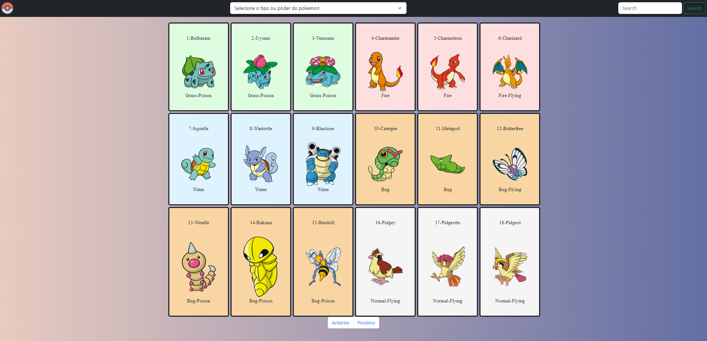
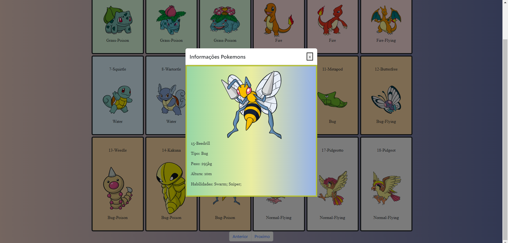
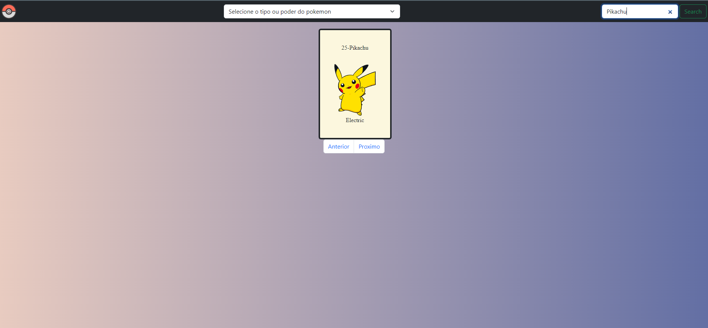

# Listagem de Pokemons

O objetivo desse projeto foi construir uma interface simples para uma listagem de pokémons.

A lista de pokémons foi obtida através da API <https://pokeapi.co/>. A interface desenvolvida recebe os valores desta api e realiza algumas funções.

# Funcionalidades

## Listagem de pokémons

  - Ordenação da listagem
    - Nome do Pokemon
    - Cor do seu tipo
  - Filtro da listagem
    - Busca por **Nome**
    - Busca por **Tipo e poder**
   - Paginação da listagem

## Exibição dos dados do Pokémon (ao clicar sobre o pokémon na listagem)
  - Foto
  - Nome
  - Tipo
  - Habilidades
  - Tamanho e peso

# Desenvolvimento da interface

- Implementação utilizando HTML, CSS e JavaScript.

- Framework utilizado para customização: Bootstrap.

# Como executar este projeto?

- Para rodar esse projeto, basta baixar este respositório e executa-lo em sua máquina, acessando o arquivo index2.html

# Interface do projeto

- Ao iniciar o projeto, a interface mostrada ao usuário será da lista contendo 18 pokemons, tendo uma opção de selecionar o tipo e poder do pokemon e uma de busca pelo seu nome.

- Quando o usuário efetua o clique sobre algum pokemon, um card é apresentado na tela com sua imagem e informações.

- Caso o pokemon não tenha uma imagem na API, o mesmo é representado pela logo do anime.

- Ao pesquisar o pokemon, sua imagem é apresentada na tela e ao clicar no card, suas informações.

#

  